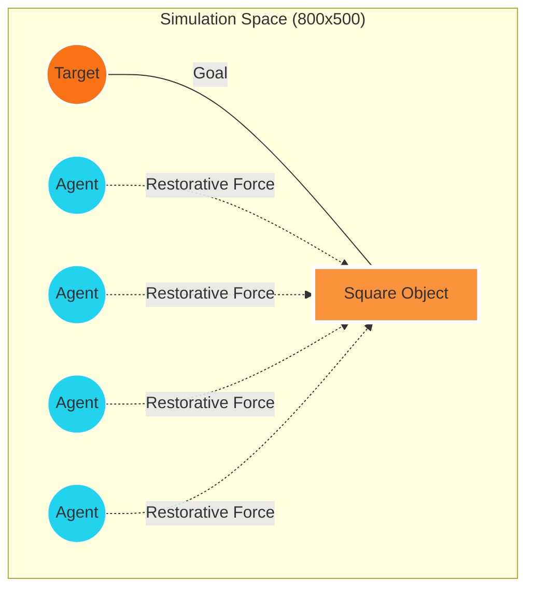
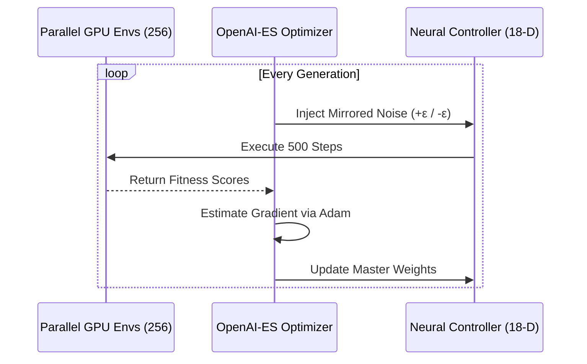

# 🐝 Swarm Intelligence: Decentralized Object Transport (ES-Marathon)

[](https://github.com/MochizukiShinichi/swarm/actions/workflows/deploy.yml)
[](https://mochizukishinichi.github.io/swarm/)

A high-fidelity GPU-accelerated swarm simulation implemented in **Python (Taichi)** and **React (Vite)**. This project evolves a group of 100 autonomous agents to collaboratively move a rigid object to a target using **OpenAI Evolutionary Strategies (OpenAI-ES)**.

---

## 🧪 Experiment Setting

The experiment is designed to solve a complex multi-agent coordination problem where no single agent can move the object alone. They must learn to synchronize their vectors to overcome the object's mass and inertia.

### 📐 Physical Layout


### 📋 Key Parameters
| Parameter | Value | Description |
| :--- | :--- | :--- |
| **Agent Count** | 100 | Autonomous particles with 18-D sensors |
| **Parallel Envs** | 256 | High-throughput GPU training episodes |
| **Physics Model** | Hooke's Law | Continuous spring-based soft collisions |
| **Optimizer** | Adam | Gradient estimation via mirrored noise (Antithetic) |
| **Brain Architecture** | 18 → 64 → 2 | MLP controller determining force vectors |

---

## 🧠 Training Workflow

The simulation leverages **Taichi Lang** to run the physics and neural network kernels directly on the GPU, achieving thousands of frames per second.



---

## 🚀 Getting Started

### 1. Training (Python)
Ensure you have a GPU supporting CUDA, Vulkan, or Metal. We recommend using `uv` for dependency management.
```bash
# Install dependencies and start the ES-Marathon
uv run python swarm_sim.py
```

### 2. Live Evaluation (Web)
The web interface features a **1:1 Physics Mirror** in Native JavaScript. It evaluates the trained `policy.json` with mathematical parity to the Python trainer.
```bash
cd web
npm install
npm run dev
```

---

## 🏆 Emergent behaviors
Through the Evolutionary process, the swarm discovers sophisticated coordination tactics:
*   **C-Shaped Wrapping**: Agents learn to form a concave shell around the object to prevent lateral sliding.
*   **Dynamic Braking**: Agents on the target side learn to yield or provide counter-pressure to stop the object precisely.
*   **Local Consensus**: Agents sense the velocity of their neighbors to stay grouped (flocking behavior).

---

## 📂 Repository Structure
*   `swarm_sim.py`: The core GPU trainer (Taichi + Adam Optimizer).
*   `web/`: React + Vite web evaluator with custom physics parity.
*   [**ALGORITHM.md**](./ALGORITHM.md): Deep dive into Hooke's Law, Reward Shaping, and 1:1 Physics Parity.

---
*Created by MochizukiShinichi - Distributed under the MIT License.*
