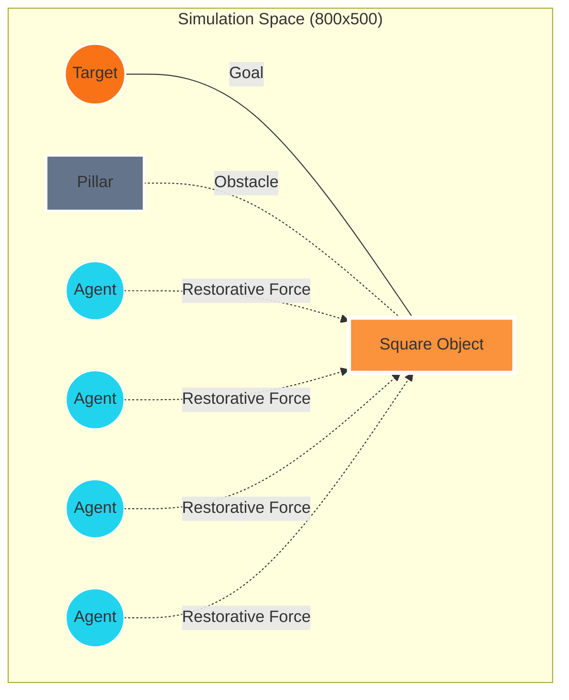
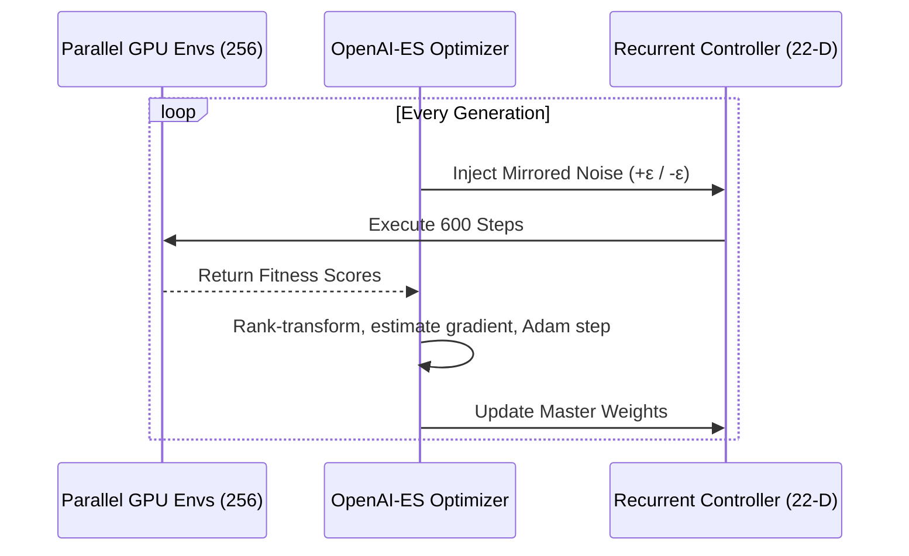

# 🐝 Swarm Intelligence: Decentralized Object Transport (ES-Marathon)

[](https://github.com/MochizukiShinichi/swarm/actions/workflows/deploy.yml)
[](https://mochizukishinichi.github.io/swarm/)

A high-fidelity GPU-accelerated swarm simulation implemented in **Python (Taichi)** and **React (Vite)**. This project evolves a group of 100 autonomous agents to collaboratively move a rigid object to a target using **OpenAI Evolutionary Strategies (OpenAI-ES)**.

---

## 🧪 Experiment Setting

The experiment is designed to solve a complex multi-agent coordination problem where no single agent can move the object alone. They must learn to synchronize their vectors to overcome the object's mass and inertia. As difficulty rises, static pillars appear between the object and the target, forcing the swarm to navigate as well as push.

### 📐 Physical Layout

```mermaid
graph TD
    subgraph "Simulation Space (800x500)"
    T((Target)) -- "Goal" --- O[Square Object]
    P1[Pillar] -. "Obstacle" .- O
    A1((Agent)) -. "Restorative Force" .-> O
    A2((Agent)) -. "Restorative Force" .-> O
    A3((Agent)) -. "Restorative Force" .-> O
    A4((Agent)) -. "Restorative Force" .-> O
    end

    style T fill:#f97316,stroke:#fff,stroke-width:2px
    style O fill:#fb923c,stroke:#fff,stroke-width:4px
    style P1 fill:#64748b,stroke:#fff,stroke-width:2px
    style A1 fill:#22d3ee,stroke:#fff
    style A2 fill:#22d3ee,stroke:#fff
    style A3 fill:#22d3ee,stroke:#fff
    style A4 fill:#22d3ee,stroke:#fff
```

### 📋 Key Parameters
| Parameter | Value | Description |
| :--- | :--- | :--- |
| **Agent Count** | 100 | Autonomous particles with 22-D inputs |
| **Parallel Envs** | 256 | High-throughput GPU training episodes |
| **Episode Length** | 600 steps | Per-generation rollout horizon |
| **Physics Model** | Hooke's Law | Continuous spring-based soft collisions |
| **Broadphase** | 40x40 grid | O(N) neighbor lookup instead of O(N²) |
| **Optimizer** | Adam | Gradient estimation via mirrored noise (Antithetic) |
| **Brain Architecture** | 22 → 64 → attn → GRU(16) → 6 | Recurrent attention controller |

The 22-D input is 18 spatial sensors plus 4 coordination signals. The 6-D output is a 2-D force vector plus a 4-D message broadcast to neighbors. See [ALGORITHM.md](./ALGORITHM.md) for the full derivation.

---

## 🧠 Training Workflow

The simulation leverages **Taichi Lang** to run the physics and neural network kernels directly on the GPU, achieving thousands of frames per second.


```mermaid
sequenceDiagram
    participant GPU as Parallel GPU Envs (256)
    participant ES as OpenAI-ES Optimizer
    participant Policy as Recurrent Controller (22-D)

    loop Every Generation
        ES->>Policy: Inject Mirrored Noise (+ε / -ε)
        Policy->>GPU: Execute 600 Steps
        GPU-->>ES: Return Fitness Scores
        ES->>ES: Rank-transform, estimate gradient, Adam step
        ES->>Policy: Update Master Weights
    end
```

Training advances through a **metric-gated curriculum**: difficulty only increases once the swarm sustains a target Success Rate, Efficiency, and Consistency over a 50-generation rolling window. On a 200-generation fitness plateau the optimizer adapts its learning rate and noise scale automatically.

---

## 🚀 Getting Started

### 1. Training (Python)
Requires Python 3.12+ and a GPU supporting CUDA, Vulkan, or Metal. We recommend using `uv` for dependency management.
```bash
# Install dependencies and start the ES-Marathon
uv run python main.py
```
Checkpoints are exported to `web/public/policy.json` every 100 generations, so the web evaluator can pick up a run in progress.

### 2. Live Evaluation (Web)
The web interface features a **1:1 Physics Mirror** in TypeScript. It evaluates the trained `policy.json` with mathematical parity to the Python trainer.
```bash
cd web
npm install
npm run dev
```

### 3. Verification
```bash
uv run python tests/parity_check.py   # Python ↔ JS physics parity
uv run python tests/memory_check.py   # GRU state persistence
uv run python tests/comm_check.py     # Neighbor messaging
```

---

## 📊 Current Status

Training is mid-curriculum. See [docs/PROGRESS.md](./docs/PROGRESS.md) for the full report.

| Phase | Capability | Status |
| :--- | :--- | :--- |
| **1 — Foundations** | Coordinated pushing to target | ✅ Passed gate (SR 0.99) |
| **2 — Memory** | GRU recall, neighbor messaging | ✅ Implemented |
| **2 — Navigation** | Obstacle avoidance | 🔄 Below gate (SR 0.45 vs 0.90 target) |
| **3 — Coordination** | Dot-product attention | 🔄 Implemented, not yet trained |

The current blocker is **sensory, not architectural**: agents have sophisticated processing (GRU + attention) but only sense obstacles on contact, which is too late to redirect momentum. The planned fix expands sensors to a panoramic 30-D view of all four pillars — see [docs/plans/](./docs/plans/).

---

## 🏆 Emergent behaviors
Observed in the open-arena regime (Phase 1, no obstacles):
*   **C-Shaped Wrapping**: Agents form a concave shell around the object to prevent lateral sliding.
*   **Dynamic Braking**: Agents on the target side yield or provide counter-pressure to stop the object precisely.
*   **Local Consensus**: Agents sense neighbor velocity to stay grouped (flocking behavior).

Targeted but not yet demonstrated, pending the Phase 2 navigation gate:
*   **Role Differentiation**: Attention lets agents specialize into pushers versus scouts.
*   **Arc Formations**: Pushing arcs that deform to squeeze through gaps between obstacles.

---

## 📂 Repository Structure
*   `engine.py`: Taichi GPU kernels — physics, sensors, and the neural controller.
*   `optimizer.py`: OpenAI-ES with Adam, rank-based fitness, and plateau adaptation.
*   `main.py`: Training loop, curriculum gating, and checkpoint export.
*   `tests/`: Parity, memory, and communication verification scripts.
*   `web/`: React + Vite web evaluator with custom physics parity.
*   `docs/`: Progress reports and implementation plans.
*   [**ALGORITHM.md**](./ALGORITHM.md): Deep dive into Hooke's Law, Reward Shaping, and 1:1 Physics Parity.

---
*Created by MochizukiShinichi - Distributed under the MIT License.*
